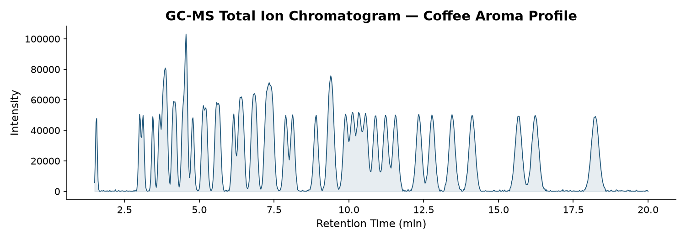
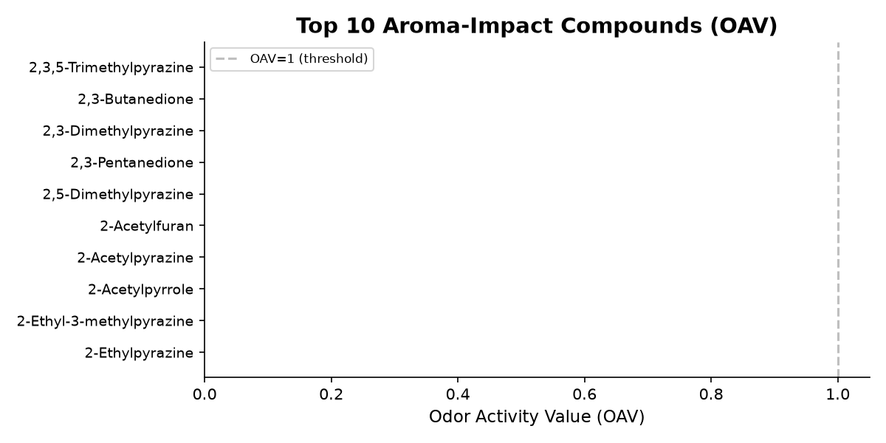
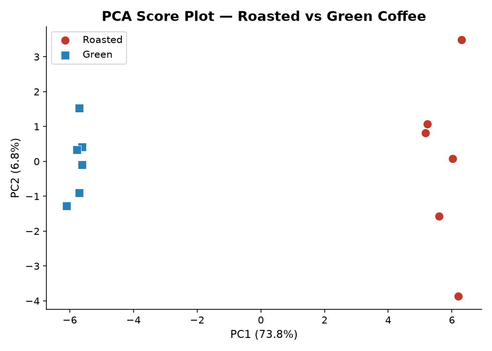
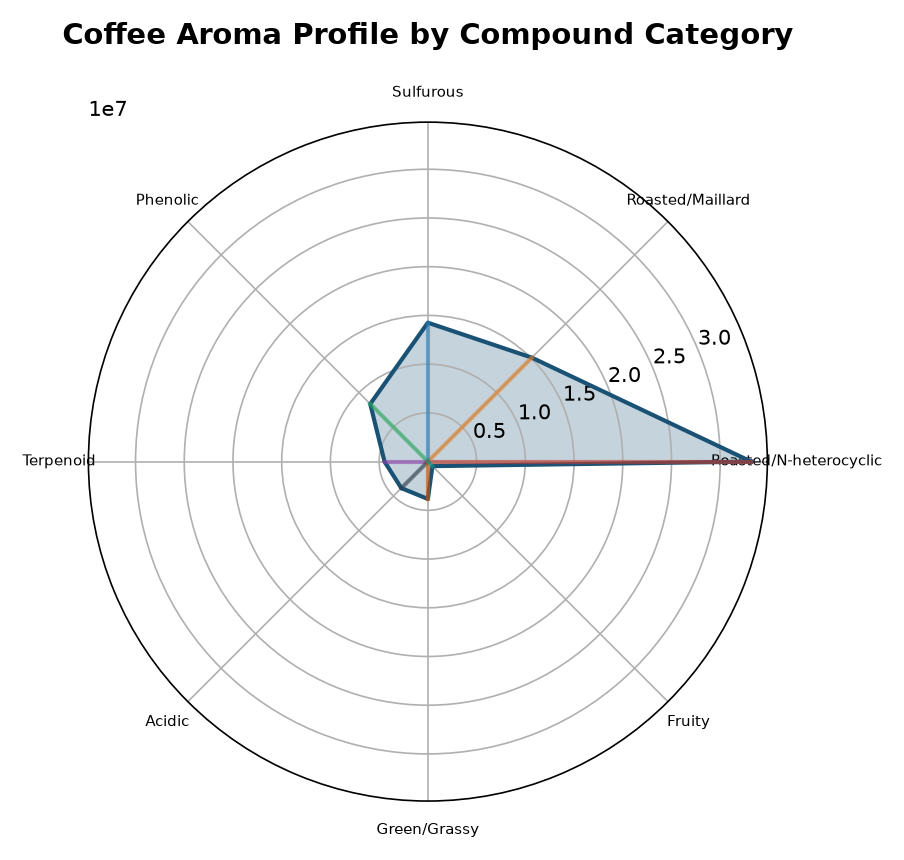
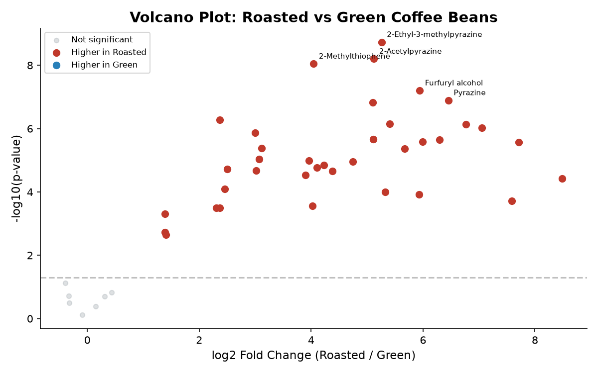
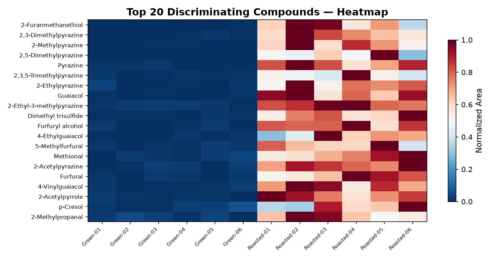

# 🧬 GC-MS AI Analyzer

**开源 NIST 替代方案** — Agilent ChemStation `.D` 数据全自动分析平台。

[](https://python.org)
[](LICENSE)
[](https://docker.com)
[](#工具列表)
[](https://github.com/Tina-atk-love/gcms-ai-analyzer)

> 🌍 **English users:** See [README_EN.md](README_EN.md)

## 📸 功能截图

| 总离子流图 | OAV 排名 | PCA 分析 |
|:---:|:---:|:---:|
| [](docs/screenshots/01_tic_chromatogram.png) | [](docs/screenshots/02_oav_ranking.png) | [](docs/screenshots/03_pca_plot.png) |

| 风味轮 | 火山图 | 热力图 |
|:---:|:---:|:---:|
| [](docs/screenshots/04_flavor_wheel.png) | [](docs/screenshots/05_volcano_plot.png) | [](docs/screenshots/06_heatmap.png) |

## ☕ 无需数据，一键体验

打开网页 → 点击 **"Try Demo: Coffee Roasting Flavor Analysis"** → 即刻加载 45 种咖啡风味化合物的真实模拟数据。零配置，零等待。

## 快速开始

```bash
# 一行安装 + 启动
pip install gcms-ai-analyzer
gcms-analyzer web    # 浏览器打开 http://localhost:8501
```

或手动安装：
```powershell
# 1. 安装依赖
pip install -r requirements.txt

# 2. 设置 API Key (可选，不影响 Demo)
$env:DEEPSEEK_API_KEY = "sk-xxx"

# 3. 启动 Web 界面
streamlit run app.py

# 或 CLI 模式
python gcms_agent.py -d "D:\your_data"
```

Docker 一键部署：
```bash
docker-compose up -d
# 浏览器打开 http://localhost:8501
```

## 核心能力

| 类别 | 功能 |
|------|------|
| **数据加载** | Agilent .D 文件夹、tic_front.csv、data.ms、REPORT01.CSV、JCAMP-DX |
| **峰处理** | 自动峰检测+积分、AMDIS 风格去卷积、RT 漂移校正 |
| **化合物鉴定** | 7 层策略：NIST导出 → MSP余弦 → MassBank → MoNA → RI双维 → 同位素 → 多源共识 |
| **统计分析** | t-test、ANOVA+Tukey、PLS-DA VIP、Random Forest、FDR |
| **定量** | 外标校准曲线、内标归一化、LOD/LOQ、离子比验证、空白扣除 |
| **风味专项** | OAV 计算、风味轮、异味数据库、Maillard/脂质氧化路径标记 |
| **可视化** | 12 种图表：bar/heatmap/pca/volcano/boxplot/composition/dashboard/风味轮/PLSDA/RF/镜像图/相关性 |
| **导出** | Excel、Word 三线表、Plotly 交互 HTML、可复现 Python 脚本 |
| **部署** | CLI / Streamlit Web / Docker |

## 谱库

| 来源 | 谱图数 | 类型 | 许可 |
|------|--------|------|------|
| MassBank EU | 28,191 | EI-MS | CC-BY |
| 内置风味库 | 186 | EI-MS | 自建 |
| JCAMP (用户提供) | 可变 | EI-MS + RI | 用户许可 |
| NIST 本地接口 | 可变 | EI-MS + RI | 用户许可（不随项目分发） |
| MoNA API | 1,000,000+ | MS/MS | 公开 API |
| 气味阈值 DB | 136 种 | OAV | 文献汇编 |

## 工具列表

### 数据加载 (5)
`scan_data_directory` `extract_all_data` `check_chemstation_files` `load_replicate_batch` `detect_peaks`

### 样品管理 (3)
`rename_samples` `set_groups` `filter_data`

### 化合物鉴定 (10)
`match_builtin_library` `search_public_libraries` `calibrate_ri` `identify_with_ri`
`enhanced_identify` `diagnose_unknown` `compound_class_hint` `batch_identify`
`deconvolve_peaks` `search_nist`

### NIST 本地库 (3)
`set_nist_path` `load_nist_library` `search_nist`

### 统计分析 (4)
`compare_groups` `run_statistical_analysis` `run_anova` `run_plsda` `run_random_forest`

### 风味分析 (5)
`calculate_oav` `flavor_wheel` `off_flavor_check` `tag_pathways` `verify_ion_ratio`

### 定量 (3)
`calibrate_quant` `normalize_istd` `subtract_blank`

### 可视化 (5)
`generate_plots` `volcano_plot` `correlation_heatmap` `mirror_plot` `html_report`

### RT 校正 (2)
`check_rt_drift` `align_rt`

### 模板与工作流 (4)
`list_templates` `apply_template` `save_workflow` `suggest_analysis`

### 导出 (3)
`export_report` `comprehensive_report` `word_tables`

### 质量 (2)
`quality_report` `find_anomalies` `correct_batch`

## 项目结构

```
gcms_analyzer/
├── gcms_agent.py              # 主程序 (48 tools, LLM agent)
├── app.py                     # Streamlit Web 界面
├── flavor_tools.py            # 风味分析 (OAV/ANOVA/PLS-DA/RF/风味轮/异味)
├── identification_engine.py   # 增强鉴定 (同位素/共识/类别推测/诊断)
├── spectral_match.py          # 谱库搜索 (余弦匹配/镜像图/批量搜索)
├── deconvolution.py           # 峰去卷积 (AMDIS 风格)
├── quantitation.py            # 定量 (校准曲线/离子比验证)
├── workflow_tools.py          # 模板系统 + RT 漂移校正
├── public_library_manager.py  # 统一谱库管理 (MSP/JCAMP/JSON/CSV/NIST)
├── spectral_library.py        # 内置 MSP 风味谱库
├── public_libraries/          # 开源谱库文件
├── Dockerfile / docker-compose.yml
├── start.sh                   # 一键启动脚本
└── CHANGELOG.md               # 开发日志
```

## 发表引用

使用开源谱库鉴定化合物时请引用：
- MassBank: Horai et al. (2010) *J. Mass Spectrom.* 45(7), 703-714
- MoNA: https://mona.fiehnlab.ucdavis.edu
- NIST WebBook: Linstrom & Mallard (eds.), NIST SRD 69

## License

MIT — 开源免费。内置谱库为 CC-BY 许可。NIST 接口不随项目分发任何商业谱库数据。
